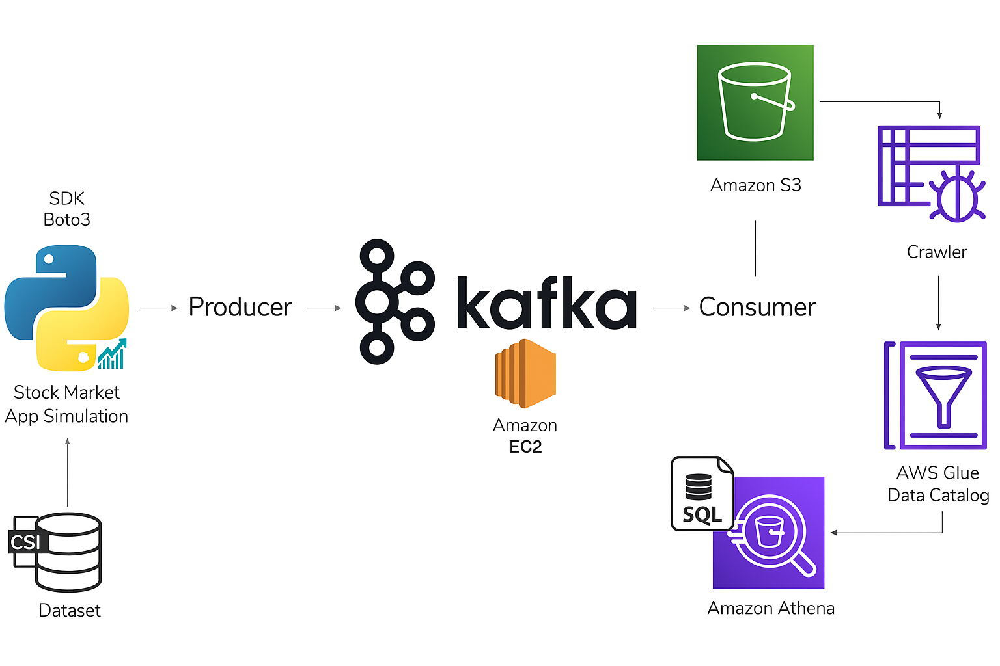

# Kafka Stock Market Data Pipeline 

This project implements a real-time data pipeline using **Apache Kafka**, **AWS S3**, **AWS Glue**, and **Amazon Athena** to simulate and analyze stock market data in a serverless, scalable environment.

---

## Tech Stack

- **Kafka** – Real-time messaging system for stock data streaming
- **Python** – Producer & consumer scripts using `kafka-python`
- **AWS EC2** – Kafka hosted on a t2.micro instance
- **AWS S3** – Storage for JSON-serialized stock data
- **AWS Glue** – Crawler for schema discovery and Data Catalog management
- **Amazon Athena** – Serverless SQL engine to query the raw JSON data in S3

---



##  Project Structure

```bash
.
├── producer.py             # Sends random stock data to Kafka topic
├── consumer.py             # Consumes Kafka messages and writes to S3
├── .env                    # Stores S3 bucket and Kafka config (excluded from Git)
├── data                    # stock data for simulation of realtime stock market using python
└── README.md               # Project overview


